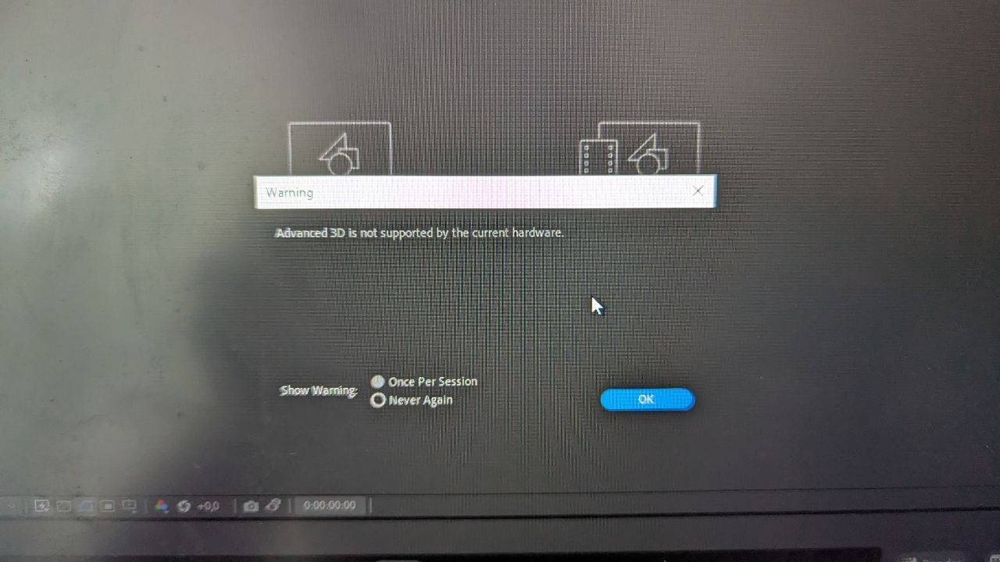

# Документация компонента "Слайд-шоу"

## Обзор

Компонент `slideShow` представляет собой блок контента для создания слайд-шоу с несколькими изображениями и сопутствующими текстовыми элементами. Поддерживает многоязычные подписи и различные типы контента.

## Структура

```
awdawd
```

### Основные свойства

- **label**: Название компонента на разных языках
  - `en`: "Slide show" (Английский)
  - `ru`: "Слайд-шоу" (Русский)
- **fields**: Массив с определениями полей слайд-шоу
- **canSelect**: `true` (компонент можно выбирать в интерфейсе)
- **isAutoCreate**: `false` (компонент не создается автоматически)

## Определения полей

### 1. Заголовок

- **label**:
  - `en`: "Caption"
  - `ru`: "Заголовок"
- **name**: `caption`
- **order**: 1 (порядок отображения)
- **type**: `string` (строка)
- **isOptional**: `false` (обязательное поле)
- **max_length**: 35 символов

### 2. Текст

- **label**:
  - `en`: "Text"
  - `ru`: "Текст"
- **name**: `text`
- **order**: 2
- **type**: `stringWithPreviewElement` (текст с предпросмотром)
- **fontSize**: 40 (размер шрифта)
- **textWidth**: 1350 (ширина текстового блока)
- **fontFamily**: "Montserrat" (шрифт)
- **fontWeight**: 600 (полужирное начертание)
- **isOptional**: `false` (обязательное поле)
- **isUpperCase**: `true` (текст в верхнем регистре)
- **max_length**: 550 символов
- **text_effects**: Эффекты текста
  - Цвет #1: `#00a5d3` (голубой)
  - Цвет #2: `#00DC6B` (зеленый)

### 3. Озвучка текста

- **label**:
  - `en`: "Text to speech"
  - `ru`: "Озвучка текста"
- **name**: `text_to_speech`
- **order**: 3
- **type**: `speech` (преобразование текста в речь)
- **max_length**: 28 символов

### 4-6. Изображения (1-3)

- **name**: `news_image1`, `news_image2`, `news_image3`
- **order**: 4, 5, 6 соответственно
- **type**: `image` (изображение)
- **isOptional**: `false` (обязательные поля)
- **max_length**: 250 символов

### 7-9. Подписи к фото (1-3)

- **label**:
  - `en`: "Photo caption №1-3"
  - `ru`: "Подпись к фото №1-3"
- **name**: `photoCaption1`, `photoCaption2`, `photoCaption3`
- **order**: 7, 8, 9 соответственно
- **type**: `string` (строка)
- **isOptional**: `true` (необязательные поля)
- **max_length**: 140 символов

## Особенности использования

1. Все три изображения являются обязательными
2. Основной текст имеет строгое форматирование
3. Поддержка английского и русского языков
4. Строгие ограничения по длине для каждого поля
5. Возможность добавления цветовых эффектов к тексту
6. Порядок полей определяется свойством `order`

[Ссылка на раздел "Установка"](./1.md)


